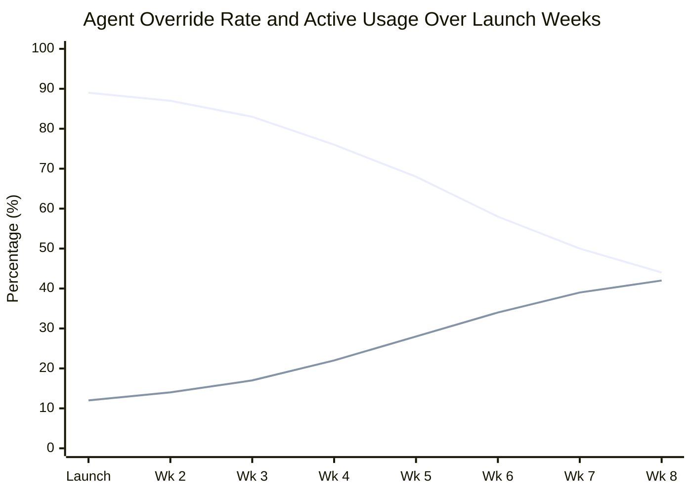

# Why an AI Copilot Lost User Trust in Six Weeks

*Simulated failure analysis — fictional product (Meridian), representative of real patterns in enterprise AI assistant deployments.*

---

The product performed at 94% accuracy in testing. In production, that number was 71%. The gap wasn't a modeling failure. It was a dataset failure, and the PM was responsible for not catching it earlier.

*Override rate climbing while active usage declined — both visible by week 3. Category-level override tracking would have revealed the adversarial-phrasing failure mode in week 1.*

---

## What Happened

Meridian was an AI workflow assistant for enterprise operations teams. It read incoming support tickets, classified them by urgency and category, and drafted an initial response for the agent to review and send. The promise: reduce agent time-to-first-response by 40% and eliminate the cognitive load of ticket triage.

Beta testing across 200 agents showed strong results: classification accuracy measured at 94%, agents reported reduced cognitive load, time-to-first-response improved 38%. Leadership approved full rollout to 1,400 agents.

Week 1: positive feedback. Week 3: agents began overriding Meridian's drafts more frequently. Week 5: an informal Slack thread among senior agents — "don't trust Meridian for [category] tickets, it's been wrong every time this week." Week 6: agent opt-out rate hit 31%. By week 8, Meridian's active usage had dropped to 44% of agents. The rollout was paused.

---

## Root Cause: The Wrong Dataset

The test dataset was drawn from the previous 90 days of tickets. The problem: the previous 90 days was a quiet period. The product had not shipped a major update. No external event had changed customer behavior. The ticket mix during testing was dominated by routine, well-structured requests that the model handled accurately.

Production introduced ticket types that weren't well-represented in the test data:

**Adversarial phrasing.** Real users write support tickets when they're frustrated. Frustrated users use sarcasm, run-on sentences, ambiguous context, and emotional framing. The test dataset had almost none of this. Meridian misclassified frustrated-customer tickets at a 34% error rate — nearly three times worse than its average.

**Compound issues.** Many real tickets contained two or more distinct problems bundled into one message. Meridian was designed to classify and respond to one primary issue; when presented with compound tickets, it latched onto one issue and ignored the other. Agents caught this immediately in production. It didn't appear in the test dataset because compound tickets were rare in the quiet period.

**Escalation-pattern tickets.** A subset of tickets had been escalated from a different channel before reaching the queue. These tickets arrived with unusual formatting and metadata that Meridian's classification model hadn't seen in training. Error rate on this category: 58%.

The 94% test accuracy was real. It was also a measurement of a dataset that didn't represent the distribution of production traffic.

---

## What the PM Got Wrong

**The eval dataset wasn't adversarially designed.** The product team pulled the most recent 90 days of tickets to build the test set. This is a natural choice. It's also wrong if the 90 days wasn't representative of the full range of production traffic. The right question to have asked: "What are the tickets this model will struggle with, and do we have enough of them in the test set?"

That question should have been answered before any accuracy number was reported to leadership. Reporting 94% accuracy as a launch signal when the eval dataset hadn't been stress-tested for hard cases was a PM failure, not an engineering failure.

**The rollout didn't have a leading indicator for trust.** The lagging indicators (opt-out rate, usage drop) were monitored. The leading indicator — agent override rate per ticket category — was not tracked in week one. If override rate by category had been on the launch dashboard, the adversarial-phrasing problem would have been visible in week one, not week six.

**The accuracy threshold was wrong.** 94% sounds strong. In a workflow where an agent reviews every output before it's sent, a 6% error rate means one in seventeen outputs requires significant correction. At 1,400 agents processing 20+ tickets per day, that's thousands of corrections daily. The cognitive load of correcting bad outputs is higher than the cognitive load of triage. The product premise — reduce cognitive load — was being undermined by a number that looked good in aggregate.

---

## What Recovery Looked Like

The rollout pause was followed by a targeted data collection initiative: deliberately sourcing and annotating hard cases (frustrated-customer tickets, compound issues, escalation-pattern tickets) to add to the fine-tuning dataset. Accuracy on those categories improved to 86-89% over two months.

The more important change: the accuracy target was redefined. The team stopped reporting overall accuracy and started reporting accuracy by ticket category, with separate thresholds for each. Categories where accuracy was below 88% were flagged in the UI — agents saw a confidence indicator that told them Meridian was uncertain. The "I'm unsure" signal increased agent trust more than the accuracy improvement did, because it let agents calibrate when to rely on the system and when to treat the output as a starting point.

Active usage recovered to 78% at six months post-incident. It never returned to the 94% seen in early rollout.

---

## The Durable Lesson

Accuracy measured on the training distribution tells you how well the model performs on cases it has seen. It tells you almost nothing about how it performs on cases it hasn't. For AI products deployed to users who will bring the full range of human behavior, the eval dataset needs to be adversarially constructed — not just representative of historical traffic.

The PM's job is to ask: "What do we not have in this dataset, and what happens when those cases arrive?" That question should precede every accuracy number reported to leadership.
