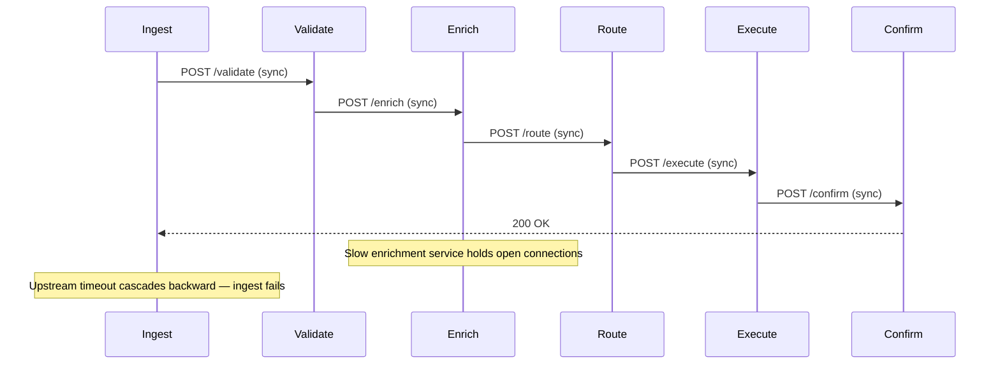
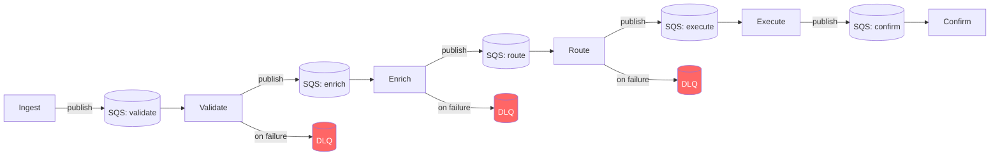

# ADR-001: Async Message Queues Over Synchronous APIs for Inter-Service Communication

*Simulated decision record — fictional company (Vantara), representative of real patterns in B2B SaaS platform infrastructure.*

---

## Status

Accepted — implemented in Q3. One significant operational gap identified post-implementation (see Consequences).

---

## Architecture: Before and After

**Before — Synchronous Chain**

**After — Async Queue Architecture**

Each stage processes at its own rate. A slow enrichment stage builds queue depth without blocking ingest. Failed messages route to DLQs rather than disappearing.

---

## Context

Vantara's order processing pipeline ran six internal services in a synchronous chain: ingest → validate → enrich → route → execute → confirm. Each service called the next via REST. At low volume this worked. At 4x load during peak periods, failure cascades became routine: a slow enrichment service would hold open HTTP connections until upstream timeouts propagated backward through the chain, taking down ingest.

The system's error behavior was also opaque. A failure in routing would surface as a 500 from ingest — the error origin was buried three hops back. On-call engineers were debugging log sequences across six services to find a single root cause.

The options on the table were:
- **Option A:** Tune timeouts and add circuit breakers to the synchronous chain
- **Option B:** Replace synchronous calls with an async message queue (SQS) between each service stage
- **Option C:** Replace the pipeline with a stream-processing model (Kafka)

The product team had a stake in this decision because the processing SLA was customer-facing: orders confirmed within 90 seconds, with degraded-state handling (order queued, not failed) during peak load. The engineering choice would directly determine whether "degraded state" was achievable or theoretical.

---

## Decision

**Chose Option B: SQS queues between each service stage.**

Option A was ruled out because circuit breakers solve isolation, not cascades — they stop the bleeding but don't change the coupling. Under sustained load, you're still shedding traffic at the front of the chain.

Option C (Kafka) was ruled out because the team did not have operational experience with Kafka and the ordering guarantees it would provide weren't required — Vantara's pipeline was idempotent at each stage, and exactly-once semantics weren't needed. The operational overhead of a Kafka cluster for this use case wasn't justified.

SQS gave us:
- **Decoupling** — each stage processes at its own rate; a slow enrichment stage builds a queue backlog without blocking ingest
- **Retry behavior** — failed messages stay in the queue; dead-letter queues captured failures without losing the message
- **Visibility timeout** — in-flight messages don't disappear if a worker crashes mid-processing
- **Backpressure** — queue depth became a leading indicator for capacity scaling

The 90-second SLA was reframed: we could now guarantee a confirmed order within 90 seconds under normal load, and a queued-not-failed state under peak load. That distinction mattered for customer communication — it changed from "your order failed, try again" to "your order is processing and will confirm shortly."

---

## Consequences

### What improved

Cascade failures stopped. Queue depth became the primary operational metric — a slow stage was visible on a dashboard in real time rather than discovered via customer escalation. Dead-letter queue volume replaced support ticket volume as the first signal of enrichment errors.

Peak-load behavior improved substantially. Under conditions that previously caused ingest failures, the system degraded gracefully: queue depth grew, processing slowed, but no messages were lost.

### What we got wrong

**Consumer lag monitoring was an afterthought.** We instrumented queue depth and DLQ volume, but not consumer lag — the delta between messages enqueued and messages processed. The operational gap this created: a consumer stuck in a processing loop would keep a message in-flight (not incrementing DLQ) while preventing any new messages from processing. Queue depth appeared normal. Consumer lag would have surfaced this immediately.

This was caught six weeks post-launch during an incident where enrichment had been silently failing on one message category for four hours. No DLQ alert fired because the consumer wasn't crashing — it was retrying and timing out internally, then returning the message to the queue without incrementing DLQ count. Consumer lag was flat at zero for that stage; the actual backlog was invisible.

We added consumer lag monitoring as a P0 operational metric in the incident response. It should have been in the original implementation.

### Constraint that persists

Async queues make debugging harder, not easier, when failures involve message content rather than infrastructure. A message that causes a processing error will cycle through the queue's retry policy before landing in the DLQ. During that window, the failure is happening but not visible. Message tracing — logging a correlation ID through every stage — partially addresses this. We implemented it; it added three weeks to the rollout timeline and should have been scoped into the original project.
