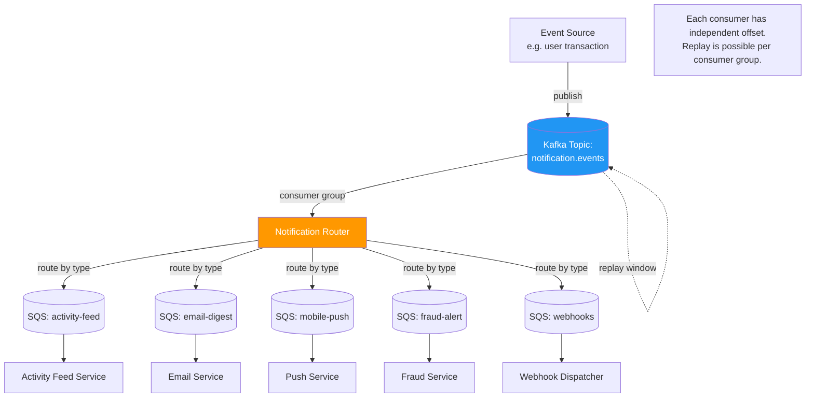

# ADR-002: Kafka for Notification Fanout, SQS for Individual Delivery

*Simulated decision record — fictional company (Nexar), representative of real patterns in platform notification infrastructure.*

---

## Status

Accepted. Two consumer group incidents in the first quarter post-launch; both documented below.

---

## Architecture: Kafka Fanout + SQS Delivery

**Key boundary:** Kafka is the event bus (fanout, replay, independent offsets). SQS queues are the delivery mechanism (at-least-once, visibility timeout, DLQ). The router bridges the two.

---

## Context

Nexar's notification platform needed to support two fundamentally different delivery patterns simultaneously:

**Pattern 1 — Fanout:** A single event (user made a transaction) needed to trigger notifications in multiple systems simultaneously: activity feed, email digest, mobile push, fraud alert, webhook to enterprise integrations. Each downstream consumer was independently owned and operated.

**Pattern 2 — Individual delivery:** A specific user notification (payment confirmed, account alert) needed to be delivered to exactly one destination with guaranteed delivery and ordered processing per-user.

The existing architecture tried to handle both patterns with a single SQS queue per consumer. This worked until fanout became a problem: adding a new consumer meant adding a new queue and publishing to it separately. A new notification type required updating seven publishing locations. The coordination overhead had become unsustainable.

The options were:
- **Option A:** Keep SQS but add SNS for fanout (SNS/SQS fan-out pattern)
- **Option B:** Introduce Kafka for fanout, retain SQS for per-user delivery queues
- **Option C:** Move everything to Kafka

---

## Decision

**Chose Option B: Kafka for event fanout; SQS for individual per-user delivery queues.**

Option A (SNS/SQS) solves the fanout coordination problem but doesn't give consumers independent replay, offset management, or the ability to reprocess historical events. When a consumer had a bug that silently dropped events for 48 hours, there was no way to replay the window. SNS/SQS is fire-and-forget with retry — not a replayable log.

Option C (Kafka for everything) was considered and rejected. Per-user delivery queues benefit from SQS's visibility timeout behavior — a message being processed doesn't disappear if the worker crashes. Kafka requires the consumer to manage offset commits; if a worker crashes mid-send, the consumer needs to re-process from its last committed offset, which means duplicates are possible and idempotency handling becomes the consumer's responsibility. For high-stakes user notifications (payment confirmed, account locked), that complexity was not worth the operational uniformity.

The hybrid model gave us:
- **Kafka** handles the broadcast problem — one event, many consumers, each with independent offsets and replay capability
- **SQS** handles the delivery problem — guaranteed at-least-once, visibility timeout, DLQ, no offset management burden on consumers

The boundary between the two is explicit: Kafka is the event bus; SQS queues are the delivery mechanism. A notification router service consumes Kafka events and routes to the appropriate SQS delivery queues.

---

## Consequences

### What improved

Adding a new consumer dropped from a multi-team coordination task to a single consumer group registration. New notification types required changes in one place (the router) rather than seven publishing locations.

Consumer replay became possible. When the mobile push consumer had a bug that dropped iOS tokens for 12 hours, we replayed the Kafka topic from the offset at failure onset. No notifications were permanently lost.

### Incident 1: Consumer Group Offset Confusion

Three weeks post-launch, a developer accidentally reset a consumer group offset to the beginning of the topic during a debugging session. The consumer began reprocessing 72 hours of notification events, sending duplicate emails to approximately 11,000 users before the spike in SES send volume triggered an alert.

Root cause: no access controls on consumer group offset management. We added IAM-scoped restrictions on offset reset operations the following week. Manual offset manipulation now requires a break-glass process with approval.

This is a PM concern, not just an ops concern: consumer group offset management is operational leverage that most engineers don't think about until it causes a customer-facing incident. The question "who can reset offsets and under what conditions" should have been in the operational runbook on day one.

### Incident 2: Lag-Based Autoscaling Delay

The notification router uses Kafka consumer lag as the autoscaling signal. During a promotional event that generated 40x normal event volume, the autoscaling delay (3 minutes to provision new consumers) meant 22 minutes of delivery lag at peak. No events were lost, but time-sensitive notifications (real-time alerts) arrived nearly half an hour late.

Root cause: lag-based autoscaling is the right steady-state mechanism but has inherent latency. For known high-volume events, pre-scaling to expected capacity should be the operational pattern. We added a scheduled scaling pre-trigger for known promotional windows.

### Constraint that persists

The Kafka/SQS boundary requires the router service to be operationally reliable. If the router falls behind, all consumer queues fall behind — it's a single point of coordination. We mitigated this with a multi-partition router and consumer group parallelism, but the architectural coupling is real. A pure Kafka or pure SQS architecture would not have this single point.
