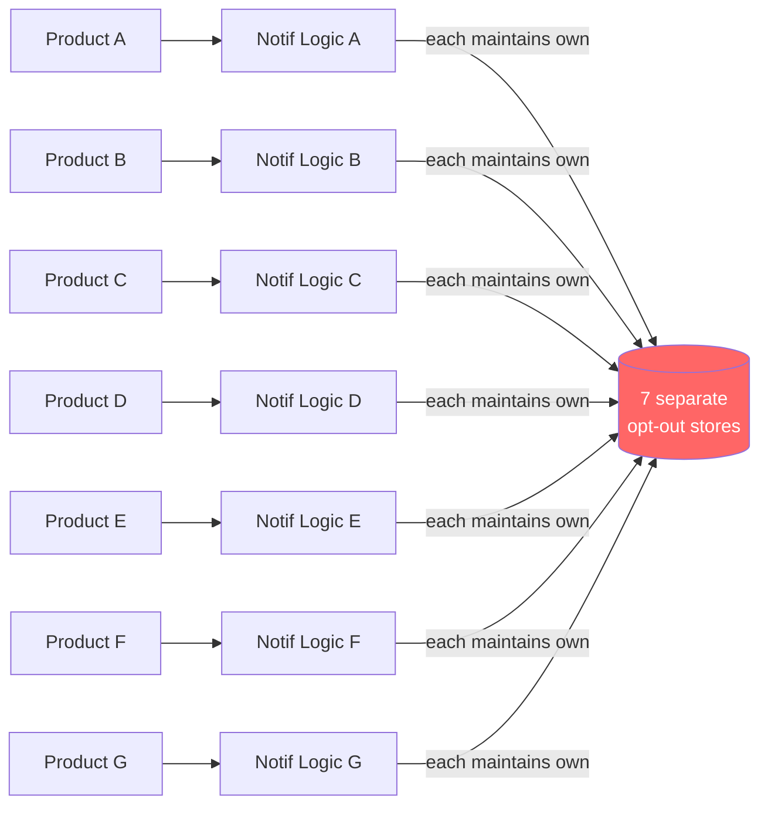
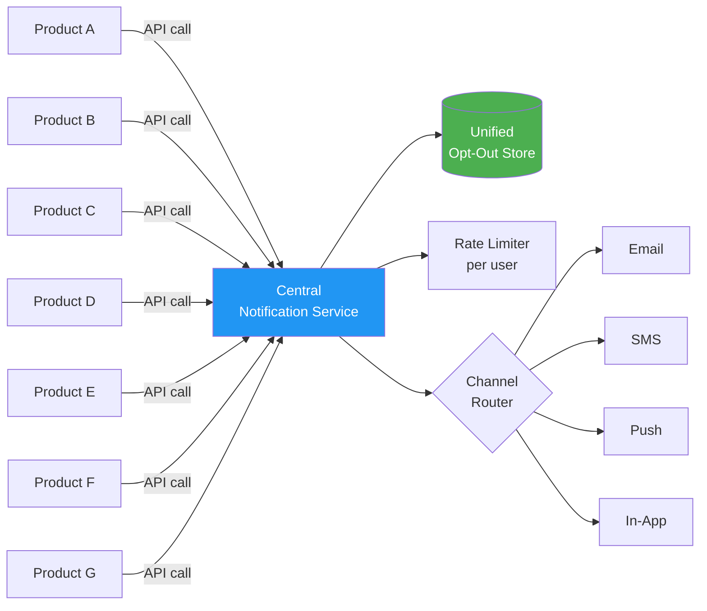

# ADR-003: Centralized Notification Service — What We Got Right, What We Didn't

*Simulated decision record — fictional company (Cordia), representative of real patterns in platform consolidation projects.*

---

## Status

Accepted and implemented. The centralization succeeded on its primary goals. The unintended consequences were significant and are documented here as operational lessons.

---

## Architecture: Before and After Centralization

**Before — 7 Independent Notification Systems**

**After — Centralized Service**

**The blast radius shift:** Before centralization, a bug in Product A's notification logic affects Product A's users. After centralization, a bug in the Central Notification Service affects all products simultaneously.

---

## Context

Cordia had seven product lines each managing their own notification logic. Seven separate codebases, seven separate email templates, seven separate send rate configurations, seven separate opt-out mechanisms — none of them consistent. Customer support regularly fielded complaints from users who had opted out in one product and continued receiving notifications from another. Compliance had flagged the fragmented opt-out state as a regulatory risk.

The business case for centralization was clear: reduce engineering duplication, ensure consistent opt-out propagation, and create a single view of notification volume per user.

What wasn't clear was the organizational complexity of centralizing something that had been owned locally for four years.

---

## Decision

**Build a centralized Notification Service as a platform capability. All product lines migrate over 12 months.**

The architecture: a single service exposing a notification API with channel routing (email, SMS, push, in-app), preference management, opt-out state, and delivery tracking. Product teams call the API; the platform handles delivery.

The case for centralization was strong:
- **Opt-out compliance:** A single opt-out store means one opt-out covers all products. The compliance risk disappears.
- **Rate limiting:** A central service can enforce per-user send rate limits across all products. Individual products had no visibility into what other products were sending the same user.
- **Operational visibility:** One dashboard showing total notification volume, delivery rates, and opt-out trends across the company.
- **Template standardization:** Brand and legal compliance reviews once, not seven times.

---

## Consequences

### What worked

Opt-out propagation became reliable and auditable within six months of the first three migrations. The compliance risk was resolved. Cross-product rate limiting reduced per-user notification volume by 23% in the first 90 days — it turned out several products were each sending what they considered "reasonable" volume, unaware of what the others were sending.

### What we got wrong: the edge case problem

Centralization inherited every team's edge cases. The central service was designed for the common case: send a notification to a user through a specified channel. But each of the seven products had accumulated local exceptions over years:

- One team needed to send transactional notifications to opted-out users for certain event types (regulatory requirement for account notices)
- One team had custom retry logic for SMS delivery that the central service didn't support
- One team had notification scheduling (send at 9am user-local-time) that the central service architecture didn't accommodate

These weren't edge cases to the teams that owned them — they were load-bearing business logic. When the centralization project kicked off, the initial requirements gathering missed all three because the teams described their main flow, not their exceptions.

The consequence: three migrations were blocked for an average of six weeks each while the central service added capabilities it hadn't anticipated. The 12-month migration timeline stretched to 19 months.

**What this means for the PM leading a centralization project:** The requirements are in the exceptions, not the main flow. Before committing to a centralization architecture, spend a week auditing each team's non-standard behavior. Document it. Design for it or explicitly decide not to support it and negotiate the exception upfront.

### What we got wrong: the blast radius problem

Before centralization, a bug in one product's notification logic affected that product's users. After centralization, a bug in the central service affects all users across all products simultaneously.

This seems obvious in retrospect. It wasn't front-of-mind during the architecture discussion, because the discussion was focused on the benefits of centralization, not the failure modes.

The first significant incident: a configuration change to the rate limiting logic that correctly throttled one product's notification burst also throttled a different product's time-sensitive account alerts. The rate limit was a global setting and there was no per-product override. Eleven thousand users didn't receive account security alerts in a two-hour window.

**What this means:** Centralized services require a fundamentally different approach to change management than local services. Every change to the central service is a change to every product. The rollout model, testing requirements, and approval process need to reflect that blast radius from day one — not after the first incident.

### What persists

The centralization was worth doing. The compliance risk was real. The operational visibility is genuinely valuable. But the honest accounting of the project is that the timeline was 60% longer than planned, two incidents in year one were directly caused by the centralization architecture, and the team that built and owns the central service has become a de facto blocker for every product team's notification feature work.

That last point is the subtlest failure mode of platform centralization: you trade local autonomy for shared capability, and the shared capability becomes a bottleneck the moment it can't keep up with the combined demand of all its consumers.
