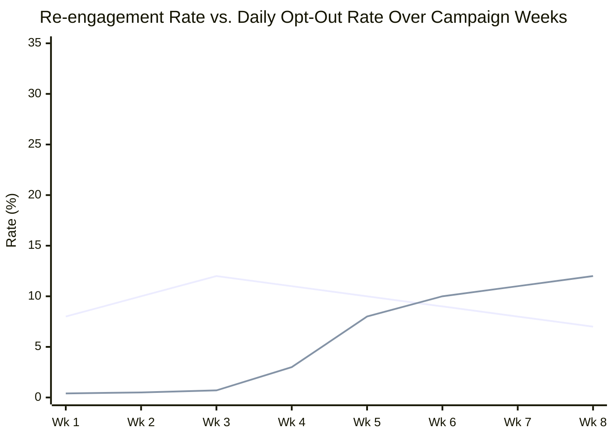

# How a Re-engagement Campaign Destroyed the Notification Channel

*Simulated case study — fictional consumer app (Crestline), representative of real patterns in notification strategy failures.*

---

The re-engagement campaign worked. Re-engagement improved 12% in the first three weeks. Then the channel collapsed.

*Re-engagement rate appeared stable (even grew). Opt-out rate — the failure signal — grew 30× before triggering a pause. By then 31% of the campaign audience had permanently opted out.*

---

## Context

Crestline was a consumer finance app with 1.4 million registered users. About 340,000 were active on a monthly basis; the rest had registered and lapsed. The growth team had a re-engagement mandate: convert lapsed users to active users.

The strategy: a push notification campaign targeting lapsed users with personalized prompts based on their last activity — reminders about unused features, account balance milestones, time-sensitive offers. The campaign was designed to run for six weeks with progressive messaging: first notification was informational, second was feature-focused, third was an offer.

The campaign launched. Results in week one: 8% re-engagement rate on first notification. Leadership called it a success. The team extended the campaign timeline and increased frequency.

---

## What the Metrics Showed

Week 1-3: Re-engagement rate 12% across the campaign. Push notification open rate on campaign messages: 14%. These were strong numbers for a lapsed-user campaign.

Week 4: Push notification open rate dropped to 9%. Opt-out rate began rising — 0.3% of the notification audience opted out of push per day, up from a baseline of 0.04%.

Week 5: Opt-out rate was 0.8% per day. The campaign audience was shrinking faster than re-engagement was adding active users.

Week 6: The decision was made to extend the campaign again based on the absolute re-engagement number (still improving). Opt-out rate hit 1.2% per day.

At the end of week 8 — two weeks past the original campaign end date — the team ran a full-channel audit. The findings were worse than expected.

---

## What the Audit Found

**31% of the original campaign audience had opted out of push notifications.** The campaign had been sent to 310,000 lapsed users. At the audit date, 96,000 of them had disabled push notifications entirely — not just from the campaign, but from the app. They would not receive any push notification from Crestline going forward.

**The re-engagement conversion rate was overstated.** The 12% re-engagement rate was calculated against the remaining active audience — users who hadn't opted out. As opt-outs grew, the denominator shrank, making the rate appear stable while the absolute number of re-engaged users was flattening.

**The channel had been permanently impaired.** Push notification opt-in rate was 78% at app install. Post-campaign, the aggregate opt-in rate across all users had dropped to 61%. That 17-point decline represented users who would now have to actively re-enable push notifications — a step almost no one takes voluntarily.

---

## What the Product Team Got Wrong

**The success metric didn't capture the failure mode.** The team tracked re-engagement rate and open rate. Neither metric detected channel degradation. Opt-out rate was tracked but wasn't a campaign success criterion — it was a compliance metric, not a product metric. The campaign was extended because re-engagement was up, while the opt-out rate — the signal that the channel was being damaged — wasn't surfaced as a counter-metric.

**The measurement window was too short.** Push notification opt-out is a cumulative behavior: each notification is a small increment of friction; opt-out happens when friction exceeds the user's tolerance threshold. A user who opts out in week four was accumulating friction since week one. A weekly measurement window couldn't show the cumulative effect; by the time the opt-out rate was alarming, the damage to the channel was already done.

**Re-engagement and channel health were treated as independent.** The assumption was that push notifications were a reusable resource — you could send them, measure re-engagement, and the channel would be in the same state for the next campaign. Push notification channel health is not a renewable resource on campaign timescales. Once a user opts out, the default behavior is permanent. The campaign consumed channel health to generate short-term re-engagement, and the trade wasn't reflected anywhere in the decision to extend.

---

## What Recovery Was and Wasn't Possible

Push notification opt-outs are permanent unless the user actively changes their settings. Of the 96,000 users who opted out, a follow-up in-app prompt six months later converted 4,200 back to opted-in — about 4%. The channel was functionally lost for the rest.

The growth team rebuilt the re-engagement strategy around email and in-app surfaces — channels where the user experience of "unsubscribing" was higher-friction and where engagement measurement was more complete (email open rates include unsubscribe tracking natively).

The notification strategy was redesigned: a channel budget per user (maximum of X push notifications per rolling 30-day window), a mandatory opt-out rate threshold that paused any campaign exceeding it, and a channel health dashboard that tracked cumulative opt-out trends separately from campaign-specific metrics.

---

## The Durable Lesson

Engagement metrics measure the users who are still engaging. They don't measure the users who left the channel because of the engagement activity. When those are the same users the campaign was designed to reach, the metric will look better as it's failing — because the denominator (users still receiving notifications) is the subset of users who haven't yet opted out.

The right counter-metric for any re-engagement campaign is opt-out rate as a leading indicator, with a defined threshold that triggers a pause. A campaign that generates 12% re-engagement and 31% opt-out isn't a successful campaign with a side effect. It's a net-negative outcome that the measurement framework was designed to miss.
